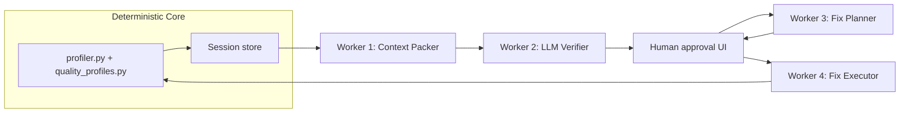

# DataLens LLM Integration Architecture Proposal

This proposal is grounded in the current codebase: deterministic profiling in `profiler.py`, sector scoring and contracts in `quality_profiles.py`, in-memory sessions with revision tracking in `api.py`, and UI surfaces in Overview / Fixes / Report dashboards.

---

## A. What LLMs should NOT do (guardrails)

**Never replace deterministic truth.**

- Do not compute scores, violation counts, or pass/fail for contract rules. Those stay in `assess_profile()` → `evaluate_rule()`. The LLM interprets and triages; Python counts.
- Do not mutate `session["df_full"]` directly. All transforms go through `apply_fixes()` (or a future audited sandbox) so `revision` increments and `_reprofile_session()` runs consistently.
- Do not invent fix types outside an allowlist. Today that is `VALID_FIX_TYPES` in `hardening.py`: `drop_nulls`, `impute_median`, `impute_mode`, `strip_whitespace`, `dedupe`. New transforms require explicit schema + tests before the Fix Executor can use them.
- Do not auto-apply fixes without human approval. Even “safe” fixes like `strip_whitespace` can destroy meaningful leading zeros or coded whitespace in survey exports.
- Do not treat LLM output as contract pass/fail. `profile_assessment.contract_passed` remains purely critical-rule deterministic; LLM adds a parallel `verification_status` layer (confirmed / rejected / needs_review).
- Do not send full datasets to the model by default. Context packer should cap rows (sample failures, column summaries, top values) and respect `DATALENS_MAX_ROWS` / session sampling (`row_sample_limit`).
- Do not expose raw PII in prompts without explicit user opt-in. Survey/healthcare/financial uploads may contain identifiers; redact or hash `respondent_id`, `patient_id`, `email` in prompts.
- Do not present chat-only narratives as “analysis.” Per project preference: every LLM claim must cite profiler evidence (`ColumnProfile.issues`, `ContractRuleResult.sample_failures`, dimension scores).
- Do not bypass upload hardening (`MAX_UPLOAD_BYTES`, `MAX_COLUMNS`, session TTL). LLM jobs are scoped to existing `session_id`.
- Do not silently change `quality_profile_id` or `required_columns`; those are upload-time user intent.

---

## B. LLM roles in DataLens (Verifier, Explainer, Fix Planner, Fix Executor)

| Role | Input | Output | Grounding |
|------|--------|--------|-----------|
| **Verifier** | Context pack: failed rules, `ColumnProfile` issues, sample rows, dimension scores | Structured JSON: `confirmed_issues`, `rejected_false_positives`, `severity`, `evidence[]` | Must reference `rule_id`, column names, and sample row indices/values from profiler |
| **Explainer** | Verified issues + profile metadata | Plain-language narrative for UI/report | Links each paragraph to verified issue IDs; no new findings |
| **Fix Planner** | Verified issues only | `{ column → fix_type }` plus rationale; optional “no safe fix” | Maps only to `VALID_FIX_TYPES` (+ future allowlisted transforms) |
| **Fix Executor** | Approved fix plan | Runs `apply_fixes()` → `_reprofile_session()` → before/after diff | Wholly deterministic; compares `revision`, scores, rules |

**Relationship to existing artifacts:**

- **Legacy layer:** `ColumnProfile.recommendations` / `issues` from `calculate_column_quality()` — heuristic, column-local.
- **Profile layer:** `profile_assessment` with `dimension_scores`, `rules[]` (`rule_id`, `name`, `severity`, `violation_count`, `sample_failures`) — sector-weighted + contract.
- **LLM layer (new):** `llm_verification` on session — semantic triage sitting *above* deterministic flags, not replacing them.

The Fixes dashboard today wires recommendations → dropdown → `POST /api/fixes`. LLM Fix Planner would pre-fill that same `Record<string, fix_type>` shape after verification + approval.

---

## C. Survey/Research verification flow (concrete example)

### Current survey profile (baseline)

From `quality_profiles.py`, profile `survey`:

- **Weights:** completeness 0.25, uniqueness 0.25, validity 0.25, type_consistency 0.15, deep_checks 0.10  
- **Column hint:** `respondent_id` → `respondent_id`, `response_id`, `id`, `uuid`  
- **Contract rules today (no survey-specific rules):**
  1. `no_duplicate_rows` (warning) — full-row duplicate count  
  2. `not_null_{col}` (critical) — for each resolved required column  

So survey “failures” today are mostly structural. Semantic survey problems often appear as **profiler issues** or **dimension weakness**, not failed contracts — which is exactly why LLM verification is needed.

### Proposed semantic rule types (Phase 1+ extensions)

Add survey-scoped rules that *flag* candidates for LLM verification (deterministic pre-filter → LLM confirm/reject):

| Proposed `rule_id` | `rule_type` | Deterministic signal | Why LLM must verify |
|--------------------|-------------|----------------------|---------------------|
| `unique_respondent` | `unique` on `[respondent_id]` | Duplicate IDs | May be intentional panel waves, test accounts, or household clustering |
| `high_item_missingness` | `max_empty_cells_per_row` | `empty_cells_per_row()` > threshold (already in `api.py` analytics) | Partial completion vs matrix skip logic vs export artifact |
| `straight_line_pattern` | `constant_across_columns` | Many Likert columns identical per row | Speeders vs legit “all neutral” vs matrix design |
| `invalid_likert_values` | `allowed_values` | Values outside 1–5 / 1–7 set | Custom codes (`-99`, `99`, `DK`) may be valid skip codes |
| `mixed_likert_encoding` | profiler `mixed_type_pct` | “Strongly agree” vs `5` in same column | Needs domain judgment on recode vs drop |
| `duplicate_submission_window` | composite unique | Same `respondent_id` + different `timestamp` | Fraud vs allowed re-takes |

Existing rules that still benefit from LLM triage when borderline:

- **`no_duplicate_rows`:** 2 duplicate rows in 50k — data entry error or intentional replication?  
- **`not_null_respondent_id`:** empty strings vs `"NA"` vs `"0"` — profiler `_empty_mask` treats some as empty; LLM checks if `"0"` is a valid anonymous placeholder.

### End-to-end survey example

**Upload:** `wave2_survey.csv`, profile `survey`, required `respondent_id, wave_id`.

**Deterministic pass:**

1. `assess_profile()` → `profile_assessment.rules`:
   - `no_duplicate_rows`: **fail**, 847 violations (1.7%)  
   - `not_null_respondent_id`: **pass**  
   - `not_null_wave_id`: **pass**  
2. `profiler` flags:
   - Column `q1_satisfaction` … `q12_satisfaction`: low cardinality numeric, some `mixed_type_pct`  
   - Column `comments`: 12% null  
3. `dimension_scores`: validity 88, uniqueness 72, type_consistency 65  

**Context packer** sends:

- Failed rule + 5 `sample_failures` rows for duplicates  
- Column profiles for Q1–Q12 (top_values, null_pct, mixed_type_pct)  
- `row_completeness` histogram from analytics  
- Survey profile weights + AAPOR source string (for prompt framing)

**Verifier JSON (example):**

```json
{
  "confirmed_issues": [
    {
      "id": "dup_panel_reentry",
      "rule_id": "no_duplicate_rows",
      "severity": "warning",
      "summary": "847 rows are exact duplicates; 80% share respondent_id with an earlier row in the same wave.",
      "evidence": ["sample_failures[0..2]", "respondent_id overlap 678/847"]
    },
    {
      "id": "likert_mixed_encoding",
      "columns": ["q3_satisfaction"],
      "severity": "warning",
      "summary": "Mixed numeric and text Likert labels in one column.",
      "evidence": ["ColumnProfile.mixed_type_pct=18.2", "top_values: '5', 'Strongly Agree'"]
    }
  ],
  "rejected_false_positives": [
    {
      "id": "straight_line_heuristic",
      "reason": "Constant answers across Q1–Q12 match 'Prefer not to say' export code 8 on all items — valid skip pattern, not speeder."
    }
  ]
}
```

**Fix Planner** (only after user approves verified list):

- `q3_satisfaction` → no auto fix in Phase 1 (needs new `map_values` transform — human-only)  
- Duplicates → propose `dedupe` on column `__rows__` (global) **only if** user confirms panel re-entry policy  
- `comments` null → suggest `impute_mode` only if user confirms blank = missing  

**Fix Executor:** applies approved `{ "respondent_id": "dedupe" }` (any real column key triggers global row dedupe today) or column-level fixes → `revision` 2 → re-profile → UI shows delta on Overview contract table and dimension scores.

**Human gates:** (1) Run verification, (2) review confirmed vs rejected, (3) approve fix plan, (4) apply.

---

## D. Multi-worker pipeline architecture



### Worker 1: Context packer (profiler output → structured prompt)

**Input:** `session_id` → `_session_payload` fields:

- `profile_assessment` (full)  
- `profiles[]` serialized (`ColumnProfile`)  
- `quality_score`, `issue_summary`, `analytics.row_completeness`  
- `applied_fixes`, `revision`, `quality_profile_id`  
- Optional: failed-rule `sample_failures` only (not full `preview`)

**Output:** `ContextPack` JSON (~2–8k tokens):

```python
{
  "session_id", "revision", "filename", "quality_profile_id",
  "profile_label", "dimension_scores", "rules_failed", "rules_passed",
  "columns_of_interest": [{ "name", "dtype", "issues", "recommendations", "stats... }],
  "samples": { "rule_id": [...] },
  "is_sampled", "total_row_count",
  "constraints": { "valid_fix_types": [...], "max_rows_cited": 5 }
}
```

Packer logic: prioritize failed critical rules, columns referenced in rules, columns with worst dimension impact for active profile weights (survey → completeness/uniqueness/validity drivers).

### Worker 2: LLM Verifier

**Input:** `ContextPack`  
**Output:** strict JSON schema:

```python
{
  "confirmed_issues": [{
    "issue_id", "rule_id"|null, "column"|null,
    "severity": "critical"|"warning"|"info",
    "title", "explanation", "evidence_refs": [...],
    "suggested_action": "fix"|"document"|"ignore"|"manual_review"
  }],
  "rejected_false_positives": [{
    "candidate_id", "rule_id"|null, "reason"
  }],
  "verification_confidence": 0.0-1.0,
  "model_id", "prompt_version"
}
```

Store on session: `session["llm_verification"] = { "revision": N, ... }` keyed to profiler revision so stale results invalidate when user applies fixes.

### Worker 3: Fix Planner

**Input:** verified `confirmed_issues` where `suggested_action == "fix"`  
**Output:**

```python
{
  "proposed_fixes": { "column_name": "drop_nulls"|... },
  "blocked_issues": [{ "issue_id", "reason": "no allowlisted fix" }],
  "expected_impact": { "rules": ["no_duplicate_rows"], "dimensions": ["uniqueness"] },
  "warnings": ["drop_nulls removes 12% of rows"]
}
```

Maps issue patterns to fixes:

| Issue pattern | Fix mapping |
|---------------|-------------|
| null/empty in column | `drop_nulls` if >50% null per UI heuristic, else `impute_median`/`impute_mode` |
| whitespace | `strip_whitespace` |
| duplicate rows | `dedupe` (any existing column key — triggers global `drop_duplicates()`; extend API with explicit global key in Phase 2) |
| mixed Likert | **no auto fix** Phase 1 — flag for manual recode |

### Worker 4: Fix Executor

**Input:** user-approved `proposed_fixes`  
**Steps:**

1. `validate_fixes()`  
2. Snapshot before: `profile_assessment`, `quality_score.overall`, `revision`  
3. `apply_fixes(df_full, profiles, fixes)`  
4. `_reprofile_session()`  
5. Compute diff: rules fixed/regressed, dimension deltas, row count change  
6. Return `{ before, after, diff, revision }`

Optional Phase 2: sandboxed pandas for transforms not in `VALID_FIX_TYPES` — execute in restricted subprocess with timeout, no network, no filesystem write, then re-profile result without committing until approved.

### Human-in-the-loop gates

| Gate | Trigger | UI |
|------|---------|-----|
| G0 | User clicks “Run AI review” | Overview or new Insights tab |
| G1 | Verifier completes | Show confirmed vs rejected with evidence links to sample rows |
| G2 | User selects issues to address | Checkbox per `confirmed_issue` |
| G3 | Fix Planner runs | Show proposed fixes with warnings; editable dropdowns (reuse Fixes UI) |
| G4 | User clicks Apply | Existing `applyFixes` flow + show revision diff |
| G5 | Export | Append “AI verification appendix” to markdown report |

---

## E. API/UI integration points

### New API endpoints (suggested)

| Method | Path | Purpose |
|--------|------|---------|
| `POST` | `/api/session/{id}/llm/verify` | Run Workers 1+2; store `llm_verification` |
| `GET` | `/api/session/{id}/llm/verification` | Poll/fetch last verification for current revision |
| `POST` | `/api/session/{id}/llm/plan-fixes` | Worker 3; body: `{ issue_ids: [...] }` |
| `POST` | `/api/session/{id}/llm/explain` | Worker Explainer only (narrative for report) |
| `POST` | `/api/fixes/preview` | Dry-run: apply to copy, return diff without mutating session (Phase 2) |

Extend `_session_payload` optionally with:

```python
"llm_verification": session.get("llm_verification"),
"llm_verification_stale": verification.revision != session.revision,
```

### UI integration (minimal churn)

**1. Overview dashboard — contract table enhancement**

Today `OverviewDashboard.tsx` shows `pa.rules` pass/fail but hides `sample_failures`. Add:

- Expandable row → sample failure rows  
- Badge: “AI: 2 confirmed, 1 false positive” when verification exists  
- Button: “Review with AI” → triggers verify  

**2. New dashboard tab: `insights` (recommended over raw chat)**

Add to `DASHBOARDS` in `datalens.ts`:

- **Insights / AI Review** — structured cards mirroring Verifier JSON, not freeform chat first  
- Side panel: Explainer narrative with citations  

**3. Fixes dashboard (`RecommendationsDashboard.tsx`)**

- Second section: “AI-suggested fixes” pre-filled from Fix Planner  
- Distinct styling from heuristic recommendations  
- Show `applied_fixes` history + revision number in header  

**4. Report dashboard**

- `generate_markdown_report()` append section: verified issues, rejected false positives, applied fix diff  
- Or `POST /api/session/{id}/llm/explain` merges narrative into export  

**5. Chat panel (Phase 3, optional)**

Scoped Q&A: “Why did uniqueness fail?” — RAG over `ContextPack` + verification, tools limited to `get_column_data`, `get_rule_samples`. Not the primary interface.

### Session model changes

```python
session = {
  ...
  "revision": 1,
  "llm_verification": None | { "revision": 1, "result": {...}, "created_at": ... },
  "llm_fix_plan": None | { "revision": 1, "proposed_fixes": {...} },
}
```

Invalidate `llm_verification` when `revision` changes (fixes, resample).

---

## F. Implementation phases

### Phase 1 — Minimal viable verifier (survey-focused)

**Scope:**

- Context packer module + `/llm/verify` endpoint  
- Verifier prompt + JSON schema for survey profile  
- Extend `build_contract_rules()` for survey: `unique_respondent` on resolved `respondent_id`  
- Heuristic pre-rules: `high_item_missingness` using `empty_cells_per_row`  
- UI: Overview “AI Review” button + verification results panel  
- Tests: mock LLM returns fixed JSON; assert session storage + revision invalidation  

**Out of scope:** auto-fix, new transform types, healthcare/financial semantic rules.

### Phase 2 — Fix loop

- Fix Planner endpoint + Fixes dashboard integration  
- `/fixes/preview` dry-run  
- Before/after diff component (rules + dimension scores + row count)  
- Append verification to markdown report  
- Gate all applies through existing `POST /api/fixes`  

### Phase 3 — Broader profiles + optional chat

- **Healthcare:** verify timeliness false alarms (future dates vs timezone), precision outliers on lab values  
- **ML training:** verify `label_present` vs class imbalance / label leakage hints from correlation dashboard  
- **Financial:** regex email failures vs plus-addressing / corporate domains  
- **Retail:** `unique_transaction` violations — returns vs duplicate POS entries  
- Scoped chat with tool calling  
- Optional local model path (Ollama) for air-gapped use  

---

## G. Tech stack options

### Model providers

| Option | Fit for DataLens | Notes |
|--------|------------------|-------|
| **OpenAI** (GPT-4.1 / o4-mini) | Strong structured JSON, good tabular reasoning | Use JSON schema / `response_format`; easy Phase 1 |
| **Anthropic** (Claude Sonnet) | Strong explanations, long context for wide surveys | Tool use for column sampling |
| **Local Ollama** (Llama 3.x, Qwen) | Privacy, no API cost | Weaker JSON adherence; needs retry + schema validation |
| **Vertex / Gemini** | If user later deploys on GCP | Consistent with other user projects |

**Recommendation:** Start with one cloud provider + strict JSON schema validation (Pydantic). Add Ollama as `DATALENS_LLM_PROVIDER=ollama` fallback for dev.

### Structured outputs vs tool calling vs code sandbox

| Approach | Use in DataLens |
|----------|-----------------|
| **Structured outputs** | Verifier + Fix Planner — primary path |
| **Tool calling** | Explainer chat: `get_column_profile`, `get_sample_rows`, `list_rules` — reads session, never writes |
| **Code execution sandbox** | Phase 2+ only for transforms beyond `VALID_FIX_TYPES`; isolated subprocess with pandas-only allowlist |

**Do not** give the LLM arbitrary `exec()` on `df_full`. Fix Executor stays Python-owned.

### Orchestration

- **Simple:** synchronous FastAPI background tasks for Phase 1 (session flag `llm_job_status`)  
- **Later:** Celery/Redis if jobs exceed 30s — not needed for polish-first scope  

### Config (env)

```
DATALENS_LLM_PROVIDER=openai|anthropic|ollama|none
DATALENS_LLM_MODEL=...
DATALENS_LLM_MAX_SAMPLE_ROWS=5
DATALENS_LLM_ENABLED=1
```

Default `none`: UI hides AI features.

---

## H. Additional feature suggestions (grounded in existing dashboards)

### Overview

- Show `sample_failures` inline for failed contract rules (data already in API)  
- LLM “explain this rule” on row click using Verifier evidence  
- Dual score display: legacy `quality_score.overall` vs `profile_assessment.overall` with LLM commentary on divergence  

### Columns / Distributions

- Link `ColumnProfile.issues` to verification status (confirmed / false positive)  
- Distributions: LLM notes on Likert vs continuous misclassification (`dtype: numeric` with 5 unique values)  

### Analytics (`AnalyticsDashboard`)

- **`row_completeness` histogram:** survey-specific insight — “40% of rows have ≥3 empty items”; feed straight-line / breakoff detection  
- **`health_radar`:** after fixes, animate revision-over-revision improvement  
- **`top_categories`:** flag suspicious dominant codes (“99” = missing) for LLM verify  

### Drift

- LLM summary of `schema_drift` + `distribution_shifted`: “New column `wave_id` added; Q3 mean shifted — instrument change or cleaning artifact?”  
- Cross-reference drift with survey wave rules  

### Correlation

- ML training profile: LLM checks high correlation between feature and `label` column hint for leakage narrative (profiler already exposes correlation matrix)  

### Fixes

- Map each `ColumnProfile.recommendation` string to fix type with LLM when heuristic dropdown is empty (e.g., mixed types → “manual review” not impute)  
- Global `dedupe` button when `no_duplicate_rows` verified  

### Report

- Sections: Deterministic contract → AI verification appendix → fix revision history (`revision`, `applied_fixes`)  
- Export JSON bundle for audit: `{ profile_assessment, llm_verification, applied_fixes }`  

### Upload flow (`UploadHero`)

- When profile = `survey`, suggest required columns from hints; warn if `missing_column_hints` includes `respondent_id`  
- Optional checkbox: “Enable AI semantic review after upload”  

---

## Summary diagram: trust boundaries

```
┌─────────────────────────────────────────────────────────┐
│  TRUSTED (deterministic)                                │
│  profile_dataframe → assess_profile → evaluate_rule     │
│  apply_fixes → _reprofile_session → revision++          │
└─────────────────────────────────────────────────────────┘
                          │
                          ▼
┌─────────────────────────────────────────────────────────┐
│  ADVISORY (LLM, structured + human-approved)            │
│  Verify semantic ambiguity → Plan fixes → User approves   │
└─────────────────────────────────────────────────────────┘
```

This architecture keeps DataLens’s core value — auditable, reproducible Python profiling — while adding LLM assistance exactly where heuristics and regex contracts are insufficient: survey semantics, false-positive triage, and guided remediation through the existing fix pipeline.

---

## I. Codebase validation review (2026-06-19)

Validation pass against the current repo (`profiler.py`, `quality_profiles.py`, `api.py`, `hardening.py`, frontend dashboards). Status key: **Verified** = matches code today; **Partial** = directionally right but incomplete or imprecise; **Gap** = not implemented / blocked; **Risk** = design assumption that conflicts with existing behavior.

### I.1 Guardrails & core pipeline (Section A–B)

| Claim | Status | Notes |
|-------|--------|-------|
| Scoring via `assess_profile()` → `evaluate_rule()` | **Verified** | `quality_profiles.py` lines 569–605 |
| `VALID_FIX_TYPES` allowlist in `hardening.py` | **Verified** | Five types exactly as listed |
| Fixes mutate `df_full` then `_reprofile_session()` | **Verified** | `api.py` `apply_fixes_endpoint` |
| `profile_assessment.contract_passed` = critical rules only | **Verified** | `critical_fail` check in `assess_profile()` |
| `DATALENS_MAX_ROWS`, upload limits, session TTL | **Verified** | `hardening.py` env vars |
| `ContractRuleResult.sample_failures` in API payload | **Verified** | Serialized via `assess_profile` → `_session_payload` |
| Fixes dashboard → `POST /api/fixes` | **Verified** | `RecommendationsDashboard.tsx` + `DataLensContext` |
| No LLM code in repo yet | **Verified** | No `/llm/*` routes or session fields |

### I.2 Survey profile baseline (Section C)

| Claim | Status | Notes |
|-------|--------|-------|
| Survey weights (0.25 / 0.25 / 0.25 / 0.15 / 0.10) | **Verified** | `PROFILES["survey"].weights` |
| Column hint `respondent_id` | **Verified** | Four aliases listed |
| AAPOR source string | **Verified** | Profile `source` field |
| Survey contract = `no_duplicate_rows` + `not_null_{col}` only | **Verified** | No `profile.id == "survey"` branch in `build_contract_rules()` |
| `empty_cells_per_row()` in analytics | **Verified** | `quality_profiles.py`; exposed as `analytics.row_completeness` via `_row_completeness_hist` |
| Proposed rules (`allowed_values`, `constant_across_columns`, etc.) | **Gap** | Not in `evaluate_rule()` — Phase 1 must extend rule engine |
| `"NA"` / `"0"` empty-string triage example | **Verified** | `_empty_mask()` treats only `""`, `NaN`, literal `"nan"` — not `"NA"` or `"0"` |

### I.3 Fix pipeline accuracy (Section C, D)

| Claim | Status | Notes |
|-------|--------|-------|
| `>50% null` → `drop_nulls` heuristic | **Verified** | `RecommendationsDashboard.getFixOptions()` |
| Global `dedupe` via `"*"` or `"__dedupe__"` sentinel | **Partial** | `apply_fixes()` dedupes entire frame when any value is `"dedupe"`, but `POST /api/fixes` requires **real column keys** in `df_full`. Workaround today: `{ "respondent_id": "dedupe" }`. Prefer explicit `__dedupe__` or optional column key in Phase 2 API. |
| `dedupe` exposed in Fixes UI | **Gap** | `getFixOptions()` never offers `dedupe` — row-level duplicate fixes need UI + planner work |
| `drop_nulls` aligns with contract `not_null` | **Risk** | `apply_fixes` uses `dropna()`; contracts use `_empty_mask()` (empty strings). Fixes may leave contract failures or remove fewer rows than users expect. Context packer / Fix Planner should surface this mismatch. |
| Example `{ "__dedupe__": "dedupe" }` | **Gap** | Would 400 today (`Unknown column(s)`) |

### I.4 Session & context packer (Section D, E)

| Claim | Status | Notes |
|-------|--------|-------|
| `_session_payload` fields listed | **Verified** | `profile_assessment`, `profiles`, `quality_score`, `issue_summary`, `analytics`, `applied_fixes`, `revision`, `quality_profile_id` |
| `dimension_scores` shape in ContextPack sketch | **Partial** | API returns an **array** of `{ dimension, score, weight, weighted_contribution }`, not a flat dict. Packer schema should match. |
| Revision invalidation on fixes | **Verified** | `_reprofile_session()` increments `revision` |
| Revision invalidation on row resample | **Partial** | Proposal mentions fixes; also invalidate on `POST /api/sample` (also calls `_reprofile_session`) |
| Profiling runs on row sample when set | **Risk** | `_reprofile_session()` profiles `_working_df()` (sampled), while fixes apply to `df_full`. LLM verification runs on **sampled** assessment unless context packer pulls full-data rule stats from `df_full`. Document explicitly in packer design. |
| `llm_verification` session fields | **Gap** | Proposed only — not in session dict yet |

### I.5 UI integration claims (Section E, H)

| Claim | Status | Notes |
|-------|--------|-------|
| Overview hides `sample_failures` | **Verified** | Contract table shows `message` + counts only |
| No `insights` dashboard tab | **Verified** | Eight tabs in `DASHBOARDS`; no `insights` |
| `generate_markdown_report()` omits AI appendix | **Verified** | Report includes contract failures (message only), not `sample_failures` or LLM |
| Dual legacy vs profile score in Overview | **Partial** | `effectiveQualityScore()` prefers profile score when present; legacy penalty score not shown side-by-side |
| Upload suggests survey required columns from hints | **Gap** | `UploadHero` has generic placeholder; `missing_column_hints` not surfaced post-upload in Overview |
| `health_radar`, `top_categories`, `distribution_shifted` | **Verified** | Present in `analytics` / drift payloads and dashboards |
| Correlation matrix for ML leakage narrative | **Verified** | `_correlation_matrix()` in `_session_payload` |

### I.6 Phase 3 profile references

| Profile | Contract rules today | Proposal assumption |
|---------|---------------------|---------------------|
| **Retail** | `unique_transaction`, `sales_non_negative` | **Verified** — matches Phase 3 retail example |
| **Financial** | `email_format` (regex warning) | **Verified** |
| **ML training** | `label_present` (`not_null` on label) | **Verified** |
| **Healthcare** | Generic only (`no_duplicate_rows` + required not-null) | **Partial** — timeliness/precision are **dimension scores** only; no clinical contract rules yet |

### I.7 Recommended corrections to this proposal

1. **Dedupe API:** Replace `__dedupe__` sentinel example with “any existing column key + `dedupe` value” as interim, and add explicit global-dedupe API shape in Phase 2.
2. **Context packer:** Note sampled-vs-full profiling split; include `total_row_count`, `is_sampled`, and optionally re-run rule evaluation on `df_full` for violation counts while keeping LLM context bounded.
3. **Fix alignment:** Phase 2 should either align `drop_nulls` with `_empty_mask` or warn in Fix Planner when contract and fix semantics differ.
4. **Verifier inputs:** `dimension_scores` in packer JSON should use the API array shape, not a dict.
5. **Phase 1 scope:** Add `dedupe` to Fixes UI when `no_duplicate_rows` fails; add Overview expandable `sample_failures` (no LLM required — data already in payload).
6. **Tests:** `tests/test_quality_profiles.py` covers retail/generic rules only — add survey contract tests when extending `build_contract_rules()`.

### I.8 Validation verdict

**Overall: architecturally sound and well-grounded.** Trust boundaries (deterministic core vs advisory LLM), worker split, human gates, and survey-first phasing align with the codebase and AGENTS.md preferences. No blocking factual errors in profile weights, rule names, or session flow.

**Proceed to Phase 1** after addressing three implementation prerequisites:

1. Extend `evaluate_rule()` / `build_contract_rules()` for survey pre-filter rules (or document that Phase 1 verifier runs on profiler issues + existing rules only).
2. Resolve sampled-vs-full profiling in the context packer contract.
3. Fix or document the `drop_nulls` vs `_empty_mask` semantic gap before auto-suggested fixes touch survey required fields.
